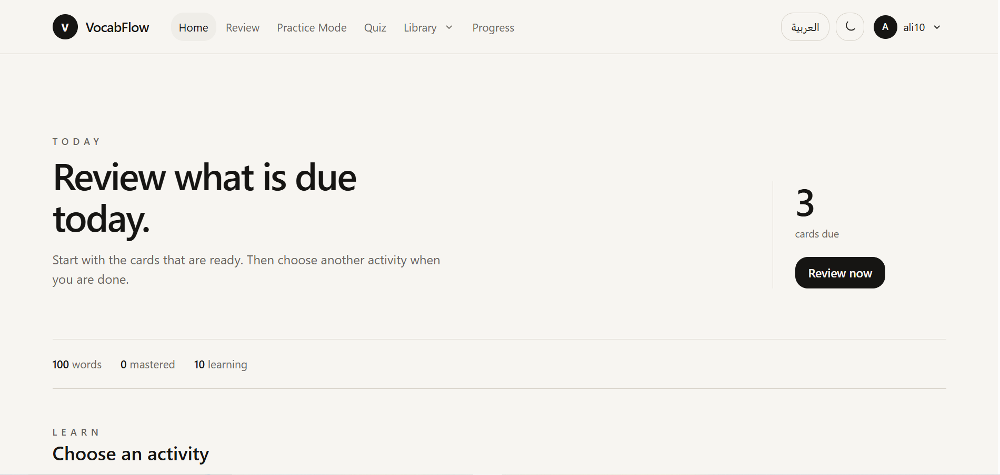
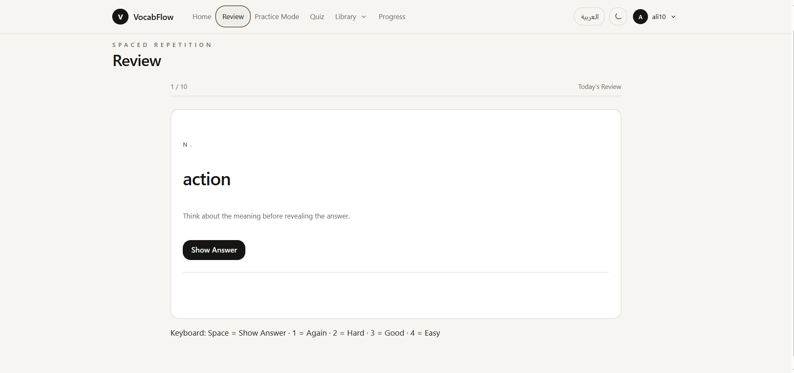
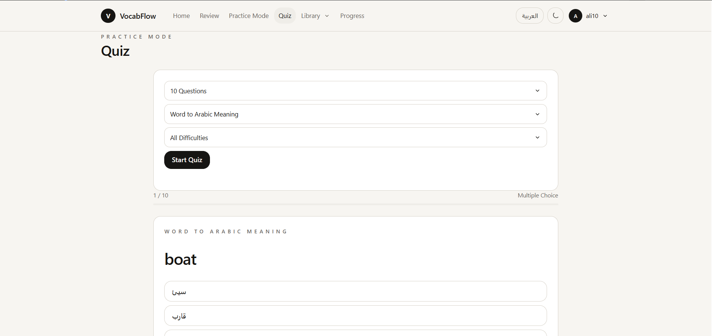
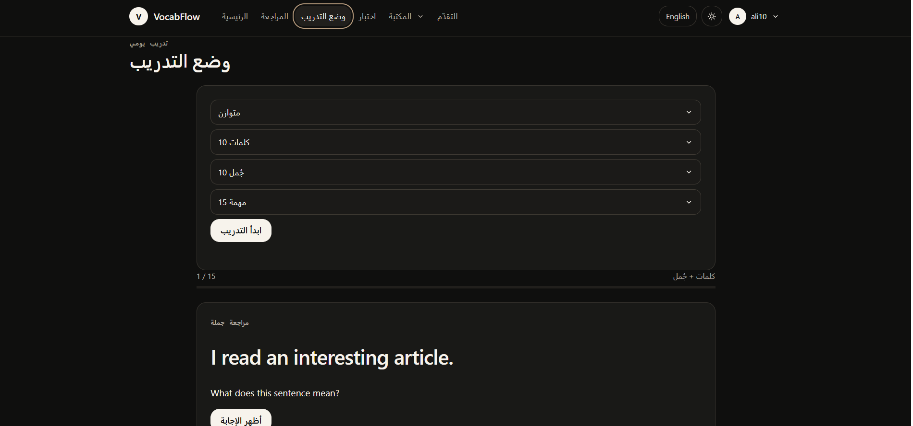

# VocabFlow

A full-stack vocabulary-learning web application built with **Flask**. VocabFlow combines spaced-repetition review, sentence practice, quizzes, and progress tracking in a clean bilingual interface (English / Arabic) with light and dark themes.

> Built as a personal full-stack project to practice backend design, authentication, security hardening, and front-end development with vanilla JavaScript.

## Features

**Learning**
- Spaced-repetition review with four ratings (Again / Hard / Good / Easy). Scheduling (interval, repetitions, ease factor, next review date) is calculated on the server, not in the browser.
- Word library: add, edit, delete, categorize, set difficulty, and mark favorites.
- Sentence library with sentence writing, sentence review, and sentence quizzes.
- Word-in-context view that links words with the sentences that use them.
- Quizzes and free practice sessions, with server-owned answer checking.
- Progress page with learning history.

**Data**
- Import and export vocabulary as CSV or JSON (with merge mode).
- Per-user data: every account only sees its own words, sentences, and history.

**Accounts and interface**
- Registration, login, logout, password change, and account deletion.
- English and Arabic localization.
- Light and dark themes.
- Responsive layout with a mobile navigation drawer.

## Security highlights

- CSRF protection and session expiration
- Rate limiting for authentication (Redis-backed in production)
- Content-Security-Policy and other security headers
- Server-side ownership of review scheduling and learning attempts
- Per-user data quotas, enforced in the application and reinforced with SQLite triggers
- CSV formula-injection protection on export
- Pinned dependencies with SHA-256 hashes (`requirements-lock.txt`)

See [SECURITY.md](SECURITY.md) for production requirements.

## Tech stack

| Layer | Technology |
| --- | --- |
| Backend | Python 3.11+, Flask 3.1 |
| Database | SQLite via SQLAlchemy 2.1 |
| Frontend | HTML, CSS, vanilla JavaScript (no framework) |
| Rate limiting | Redis (required in production) |
| Testing | pytest |


## Screenshots

| Home | Review |
| --- | --- |
|  |  |

| Quiz | Dark mode / Arabic |
| --- | --- |
|  |  |


## Getting started

VocabFlow targets **Python 3.11 or newer**.

### Windows (PowerShell)

```powershell
git clone https://github.com/ham0dy10/vocabflow.git
cd vocabflow
python -m venv .venv
.\.venv\Scripts\Activate.ps1
python -m pip install -r requirements-lock.txt
python app.py
```

### macOS / Linux

```bash
git clone https://github.com/ham0dy10/vocabflow.git
cd vocabflow
python3 -m venv .venv
source .venv/bin/activate
python -m pip install -r requirements-lock.txt
python app.py
```

Open <http://127.0.0.1:5000/> and create an account. The database file `vocabflow.db` is created automatically on first run.

For a reproducible, verified install you can use `pip install --require-hashes -r requirements-lock.txt`.

## Running the tests

```bash
python -m pip install -r requirements-dev.txt
python -m pytest
```

Runtime and project-contract tests run out of the box. The database-contract tests are skipped until a local `vocabflow.db` has been created by running the app once.

## Configuration

Copy `.env.example` to `.env` for local configuration. Main variables:

| Variable | Purpose |
| --- | --- |
| `VOCABFLOW_ENV` | `development` (default) or `production` |
| `VOCABFLOW_SECRET_KEY` | Session signing key. Required in production |
| `VOCABFLOW_COOKIE_SECURE` | Set to `1` when serving over HTTPS |
| `VOCABFLOW_PROXY_HOPS` | Number of trusted reverse proxies in front of Flask |
| `VOCABFLOW_REDIS_URL` | Redis URL for the shared rate limiter. Required in production |

## Project structure

```
vocabflow/
├── app.py                # Flask app: routes, auth, security, API
├── database.py           # Database setup, constraints, triggers
├── models.py             # SQLAlchemy models
├── migrate_legacy.py     # One-time migration for old databases
├── templates/            # Jinja2 templates (pages/ holds each screen)
├── static/
│   ├── css/vocabflow.css # Single consolidated stylesheet
│   ├── js/               # Front-end modules (review, quiz, i18n, ...)
│   └── words.json        # Sample words
├── tests/                # pytest suite
└── docs/                 # Design system notes and fix log
```

## Legacy database migration

Databases created before user ownership was introduced must be migrated explicitly. VocabFlow never assigns orphaned rows to the first account automatically.

```bash
python migrate_legacy.py --owner-id 1
```

Replace `1` with the id of the account that should own the old data. Run this once, then start the app normally.

## Documentation

- [Design system notes](docs/DESIGN_SYSTEM.md)
- [Fix log (v2-7), in Arabic](docs/FIXES_2_7.md)
- [Security notes](SECURITY.md)

## Author

**Mohammed Riyadh** — Computer Science graduate, University of Technology (Baghdad, Iraq)

- GitHub: [@ham0dy10](https://github.com/ham0dy10)
- LinkedIn: [mohammed-riyadh](https://www.linkedin.com/in/mohammed-riyadh)

## Copyright and usage

**Copyright © 2026 Mohammed Riyadh. All rights reserved.**

VocabFlow is published publicly for portfolio, educational review, and demonstration purposes.
This repository is **not released under an open-source license**. No permission is granted to copy,
modify, publish, distribute, sublicense, sell, or create derivative works from the source code
without prior written permission, except where such use is expressly permitted by applicable law.

See [COPYRIGHT.md](COPYRIGHT.md) for the full notice.
